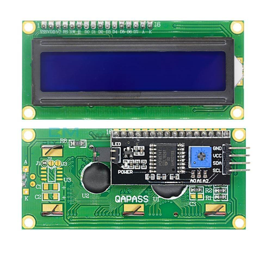
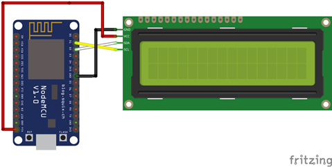

# LCD1602液晶顯示

## 實體圖

## 接線圖

## 接腳

|ESP8266|GND|Vin|D2|D1|
|-|-|-|-|-|
|LCD1602|GND|Vcc|SDA|SCL|

---

## 安裝 LiquidCrystal_I2C

至程式庫管理員，輸入 LiquidCrystal_I2C 並安裝。

## 測試

[hello_world](/esp8266/lcd/lcd_hello.ino)
